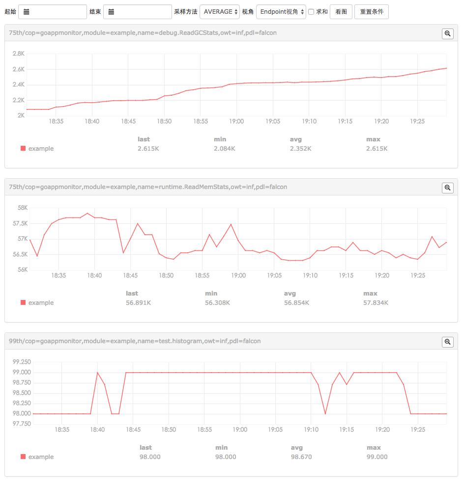

# goappmonitor
[](https://travis-ci.org/wgliang/goappmonitor)
[](https://codecov.io/gh/wgliang/goappmonitor)
[](https://godoc.org/github.com/wgliang/goappmonitor)
[](https://gitter.im/goappmonitor/Lobby?utm_source=badge&utm_medium=badge&utm_campaign=pr-badge&utm_content=badge)
[](https://landscape.io/github/wgliang/goappmonitor/master)
[](https://www.quantifiedcode.com/app/project/98b2cb0efd774c5fa8f9299c4f96a8c5)
[](https://goreportcard.com/report/github.com/wgliang/goappmonitor)
[](http://www.apache.org/licenses/LICENSE-2.0.html)

Golang application performance data monitoring.


GoAppMonitor is a library which provides a monitor on your golang applications. It contains system level based monitoring and business level monitoring(custom monitoring).Just add the repository into your apps and registe what you want to monitoring.

## Summary

Using GoAppMonitor to monitor the golang applications, in general as following:

In your golang application code, the user calls the statistics function provided by goappmonitor; when the statistics function is called, the perfcounter generates a statistical record, and is stored in memory.GoAppMonitor will automatically and regularly record these statistics push to the collector such as Open-Falcon collector(agent or transfer).

## Version

version support collector:

v0.0.1 - [Open-Falcon](https://github.com/XiaoMi/open-falcon) (Open source monitoring system of Xiaomi)

todo....

-- support more type metrics,such as ewma and flow type.
-- remove third-part library.
-- support more agent frameworks,such as elasticsearch...


## Install

    go get github.com/wgliang/goappmonitor


## Demo



## Usage

Below is an example which shows some common use cases for goappmonitor.  Check 
[example](https://github.com/wgliang/goappmonitor/blob/master/example) for more
usage.

```go
package main

import (
	"math/rand"
	"time"

	appm "github.com/wgliang/goappmonitor"
)

func main() {
	go basic()  // 基础统计器
	go senior() // 高级统计器
	select {}
}

func basic() {
	for _ = range time.Tick(time.Second * time.Duration(10)) {
		// (常用) Meter,用于累加求和、计算变化率。使用场景如，统计首页访问次数、gvm的CG次数等。
		pv := int64(rand.Int() % 100)
		appm.Meter("test.meter", pv)
		appm.Meter("test.meter.2", pv-50)

		// (常用) Gauge,用于保存数值类型的瞬时记录值。使用场景如，统计队列长度、统计CPU使用率等
		queueSize := int64(rand.Int()%100 - 50)
		appm.Gauge("test.gauge", queueSize)

		cpuUtil := float64(rand.Int()%10000) / float64(100)
		appm.GaugeFloat64("test.gauge.float64", cpuUtil)
	}
}

func senior() {
	for _ = range time.Tick(time.Second) {
		// Histogram,使用指数衰减抽样的方式，计算被统计对象的概率分布情况。使用场景如，统计主页访问延时的概率分布
		delay := int64(rand.Int() % 100)
		appm.Histogram("test.histogram", delay)
	}
}
```

## Credits

Repository is base on goperfcounter of [niean](https://github.com/niean/goperfcounter)

Logo is desigend by [xuri](https://github.com/Luxurioust)
